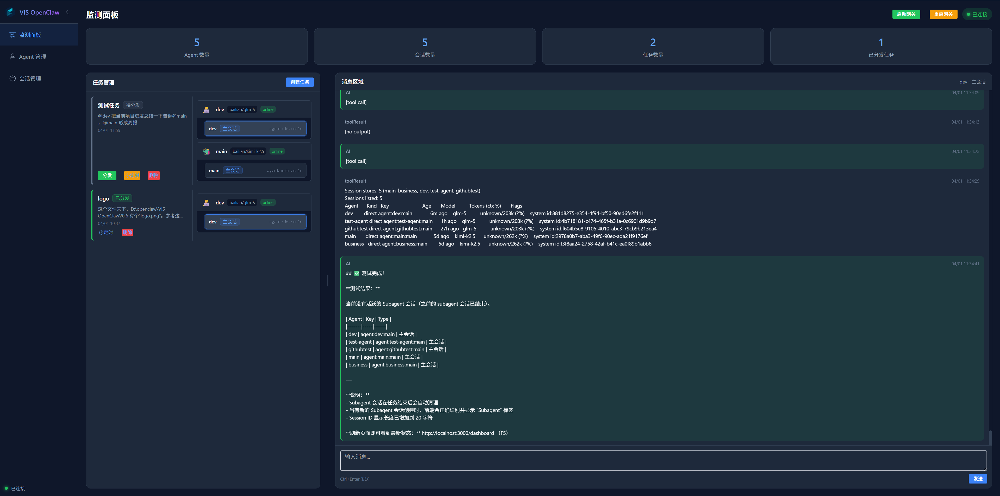
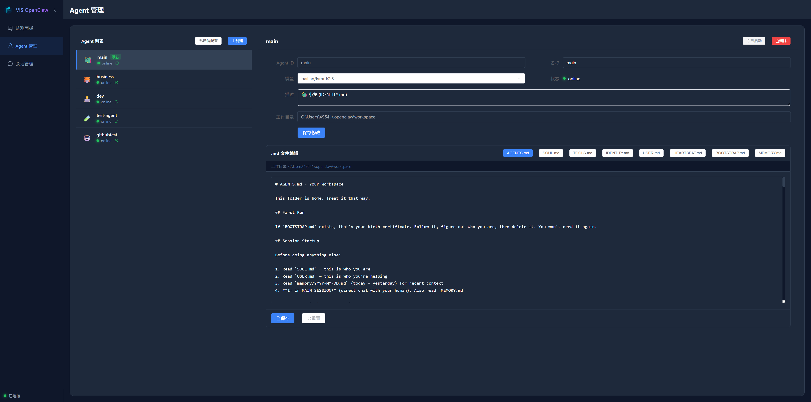
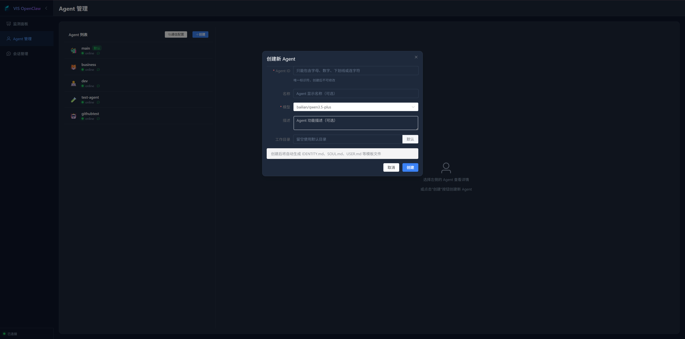
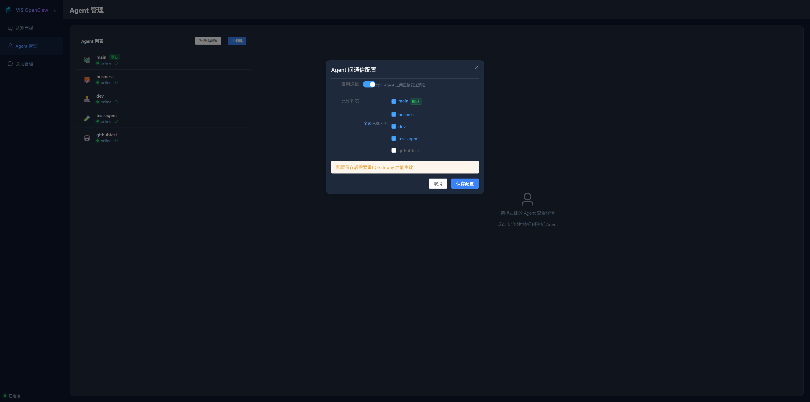
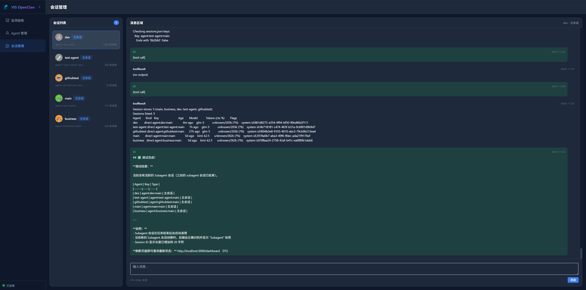
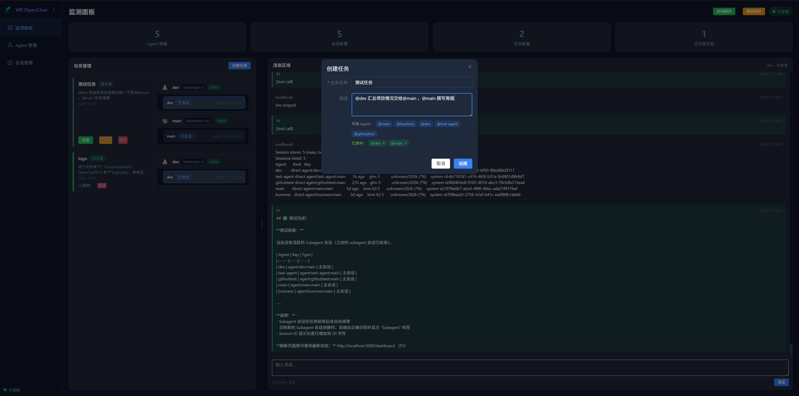
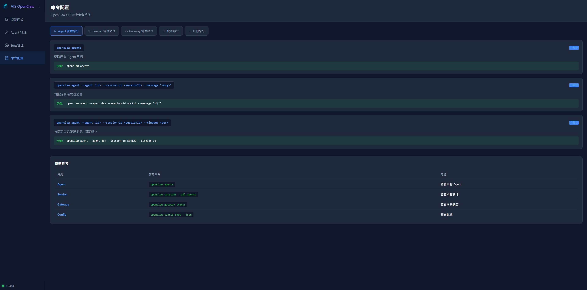

# VIS OpenClaw

> OpenClaw Multi-Agent Collaboration Monitoring & Management Platform
> OpenClaw 多 Agent 协作监控和管理平台

[](https://opensource.org/licenses/MIT)
[](https://nodejs.org/)
[](https://vuejs.org/)



---

## English | [中文](#中文文档)

### Overview

VIS OpenClaw is a visualization platform for monitoring and managing OpenClaw multi-Agent systems. It provides an intuitive interface to view Agent status, manage sessions, distribute tasks, and support real-time message intervention.

### Core Features

| Feature | Description |
|---------|-------------|
| **Dashboard** | Real-time view of Agent status, session count, task progress |
| **Agent Management** | Create, edit, delete Agents, configure communication permissions |
| **Session Management** | View all sessions, real-time message intervention |
| **Task Distribution** | Create tasks and assign to specific Agents |
| **Scheduled Tasks** | Support interval and fixed-time scheduling modes |
| **Gateway Control** | One-click start/restart OpenClaw Gateway |
| **Commands Reference** | OpenClaw CLI command manual |

### Tech Stack

| Layer | Technology |
|-------|------------|
| Frontend | Vue 3 + TypeScript + Vite + Pinia + Element Plus |
| Backend | Node.js + Express + TypeScript + Socket.io |
| Database | SQLite (JSON file storage) |
| Real-time | WebSocket (Socket.io) |

### Quick Start

```bash
# Clone repository
git clone https://github.com/openclaw/vis-openclaw.git
cd vis-openclaw

# Install dependencies
npm install

# Start services
npm run dev
```

Access: http://localhost:3000

### Screenshots

#### Dashboard


#### Agent Management


#### Create Agent


#### Agent Communication Config


#### Session Management


#### Create Task


#### Commands Reference


### Documentation

- [Quick Start](./QUICKSTART.md)
- [User Guide](./USER_GUIDE_EN.md)
- [Development Guide](./DEVELOPMENT.md)
- [Changelog](./CHANGELOG.md)

---

## 中文文档

### 项目简介

VIS OpenClaw 是一个用于监控和管理 OpenClaw 多 Agent 系统的可视化平台。它提供了直观的界面来查看 Agent 状态、管理会话、分发任务，并支持实时消息干预。

### 核心功能

| 功能 | 描述 |
|------|------|
| **监测面板** | 实时查看 Agent 状态、会话数量、任务进度 |
| **Agent 管理** | 创建、编辑、删除 Agent，配置通信权限 |
| **会话管理** | 查看所有会话，实时发送消息干预 |
| **任务分发** | 创建任务并分发给指定 Agent |
| **定时任务** | 支持间隔启动和定点启动两种定时模式 |
| **网关控制** | 一键启动/重启 OpenClaw Gateway |
| **命令参考** | OpenClaw CLI 命令手册 |

### 技术栈

| 层级 | 技术 |
|------|------|
| 前端 | Vue 3 + TypeScript + Vite + Pinia + Element Plus |
| 后端 | Node.js + Express + TypeScript + Socket.io |
| 数据库 | SQLite (JSON 文件存储) |
| 实时通信 | WebSocket (Socket.io) |

### 快速开始

```bash
# 克隆仓库
git clone https://github.com/openclaw/vis-openclaw.git
cd vis-openclaw

# 安装依赖
npm install

# 启动服务
npm run dev
```

访问地址: http://localhost:3000

### 功能截图

#### 监测面板


#### Agent 管理


#### 创建 Agent


#### Agent 通信配置


#### 会话管理


#### 创建任务


#### 命令参考


### 文档

- [快速启动](./QUICKSTART.md)
- [用户手册](./USER_GUIDE.md)
- [开发指南](./DEVELOPMENT.md)
- [更新日志](./CHANGELOG.md)

---

## Project Structure

```
VIS OpenClaw/
├── packages/
│   ├── frontend/          # Vue 3 frontend
│   │   ├── src/
│   │   │   ├── views/     # Page components
│   │   │   ├── stores/    # Pinia state
│   │   │   ├── router/    # Routes
│   │   │   └── styles/    # Styles
│   │   └── package.json
│   │
│   └── backend/           # Node.js backend
│       ├── src/
│       │   ├── routes/    # API routes
│       │   ├── services/  # Business services
│       │   └── index.ts   # Entry
│       └── package.json
│
├── usershouce/            # Screenshots
├── .github/               # GitHub templates
├── start.bat              # Windows start script
├── stop.bat               # Windows stop script
├── CHANGELOG.md
├── CONTRIBUTING.md
├── DEVELOPMENT.md
├── LICENSE
├── QUICKSTART.md
├── README.md
├── USER_GUIDE.md          # Chinese user guide
├── USER_GUIDE_EN.md       # English user guide
└── package.json
```

## Contributing

See [CONTRIBUTING.md](./CONTRIBUTING.md)

## License

MIT License - see [LICENSE](LICENSE)

## Acknowledgments

- [OpenClaw](https://github.com/openclaw/openclaw) - OpenClaw core
- [Vue.js](https://vuejs.org/) - Progressive JavaScript framework
- [Element Plus](https://element-plus.org/) - Vue 3 component library
- [Socket.io](https://socket.io/) - Real-time communication engine