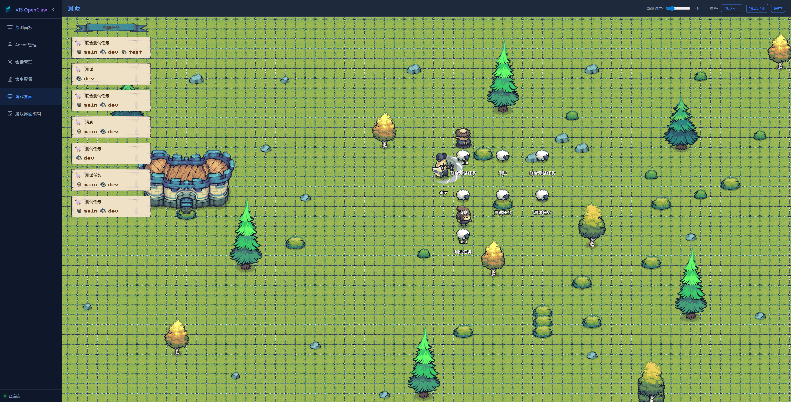
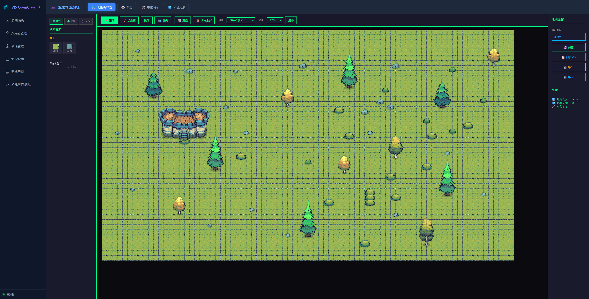
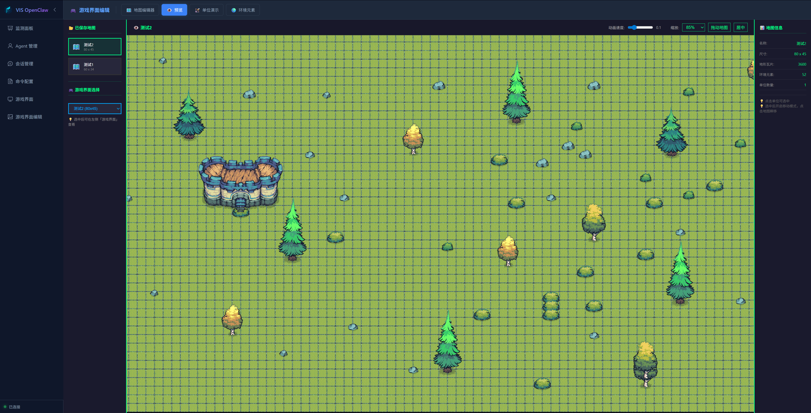
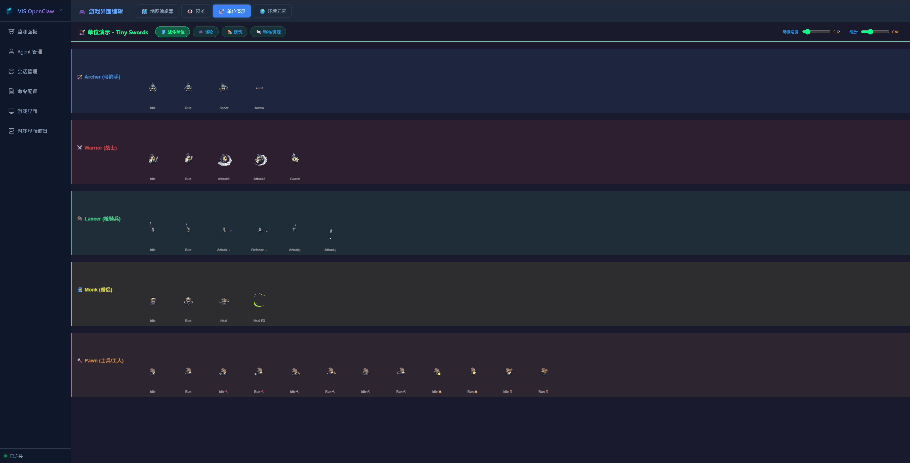
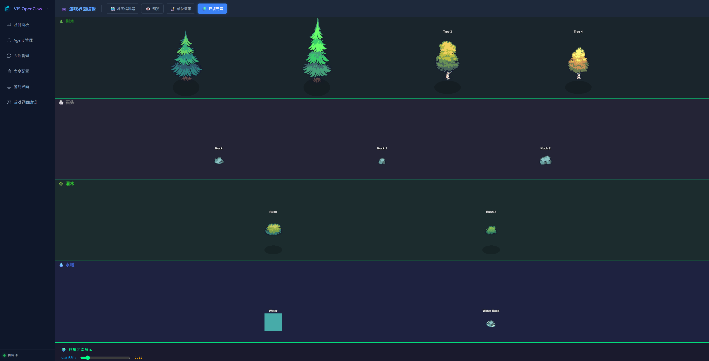

# VIS OpenClaw User Guide

Welcome to VIS OpenClaw! This guide will help you get started quickly.

## Table of Contents

1. [System Overview](#system-overview)
2. [Quick Start](#quick-start)
3. [V1.1 Highlights](#v11-highlights)
4. [Feature Guide](#feature-guide)
5. [FAQ](#faq)

---

## System Overview

VIS OpenClaw is a visualization platform for monitoring and managing OpenClaw multi-Agent systems.

### Core Concepts

| Concept | Description |
|---------|-------------|
| **Agent** | AI assistant that executes specific tasks |
| **Session** | Conversation with an Agent |
| **Task** | Work assigned to Agents |
| **Gateway** | OpenClaw gateway service |

### System Architecture

```
User → VIS OpenClaw UI → OpenClaw Gateway → Agent
```

---

## Quick Start

### Starting the System

1. Double-click `start.bat` (Windows) or run `npm run dev` (Linux/macOS)
2. Wait for services to start
3. Open browser at http://localhost:3000


### Navigation

The left sidebar contains:

| Menu | Function |
|------|----------|
| 📊 Dashboard | View system status and tasks |
| 👤 Agents | Manage AI assistants |
| 💬 Sessions | View and intervene conversations |
| 📄 Commands | OpenClaw CLI command reference |
| 🎮 Game Interface | Observe tasks, virtual task objects, and animated Agent avatars on a map |
| 🗺️ Game Interface Editor | Create maps, preview scenes, and manage unit/environment assets |

---

## V1.1 Highlights

V1.1 turns OpenClaw Agent collaboration from a list-and-log workflow into an observable, interactive task scene. The release adds a game interface, map editor, map preview, unit showcase, and environment asset showcase so users can verify task dispatch, Agent responses, and collaboration state visually.

### OpenClaw × VIS Linkage

After a task is dispatched from VIS OpenClaw, it is sent to the target Agent's OpenClaw conversation and represented in the VIS game interface. This lets users verify both sides of the workflow: whether the Agent received the message and whether the visual task scene updated.


### Game Interface

The game interface places current tasks, participating Agents, task avatars, and map environments on a pannable and zoomable canvas. It is designed for live demos, task acceptance checks, and collaboration-state observation.



### Map Editor and Preview

The map editor supports map size presets, zoom controls, brush, eraser, pan, fill, clear, import, and export. The preview page helps validate saved maps and choose the map used by the game interface.





### Units and Environment Assets

V1.1 uses Tiny Swords-style assets for virtual Agents, task scenes, terrain, buildings, and environment decoration.





### Asset Source

The game interface, map editor, unit animations, buildings, terrain, environment decorations, and selected game-style UI elements use assets from the free portion of [Tiny Swords by Pixel Frog](https://pixelfrog-assets.itch.io/tiny-swords). The project currently uses only the Tiny Swords Free Pack. The assets may be used in this project and modified as needed, but they must not be redistributed, resold, or repackaged as standalone assets. See [ASSET_CREDITS.md](./ASSET_CREDITS.md) for the full project note.

---

## Feature Guide

### 1. Dashboard

The dashboard is the main interface showing overall system status.


#### Status Indicators

| Indicator | Description |
|-----------|-------------|
| Agent Count | Total configured Agents |
| Session Count | Active sessions |
| Task Count | Created tasks |
| Distributed Tasks | Tasks sent to Agents |

#### Task Management

**Create Task**

1. Click "Create Task" button
2. Fill in task name and description
3. Use `@agentName` in description to mention Agents
4. Click Create

**Distribute Task**

1. Find the task card to distribute
2. Click "Distribute" button
3. System sends task to related Agents

**Scheduled Tasks**

1. Click "Schedule" button on task card
2. Set schedule mode:
   - **Interval**: Run every N minutes/hours
   - **Fixed Time**: Run at specific time daily
3. Save configuration

#### Task Status

| Status | Description |
|--------|-------------|
| Pending | Task created, waiting for distribution |
| Paused | Task has not been dispatched and can be resumed before dispatch |
| Scheduled | Task has schedule configured |
| Dispatching | VIS accepted the dispatch request and is writing the task into Agent sessions |
| Distributed | Task sent to Agent |
| Running | Agent session is processing the task |
| Completed | Linked Agent session completed the current turn |
| Failed | Task dispatch or linked session processing failed |
| Stale | Agent session state is temporarily unknown; refresh or wait for Gateway recovery |

After a task enters "Dispatching", "Distributed", or "Running", its state is controlled by the OpenClaw session bridge and pause is no longer available. Create a new task or handle the running session in OpenClaw if you need to change direction.

---

### 2. Agent Management

Manage OpenClaw AI assistants.


#### Agent List

Shows all Agents with their status:

| Info | Description |
|------|-------------|
| Avatar/Emoji | Agent identifier |
| Name | Agent name |
| Model | AI model in use |
| Status | Online/Offline |

#### Create Agent


1. Click "Create Agent"
2. Fill in basic information
3. Select AI model
4. Edit configuration files
5. Save

#### Edit Configuration Files

Each Agent has 8 configuration files:

| File | Purpose |
|------|---------|
| IDENTITY.md | Identity definition |
| SOUL.md | Core values |
| USER.md | User/team information |
| AGENTS.md | Workflow |
| MEMORY.md | Long-term memory |
| TOOLS.md | Tool configuration |
| HEARTBEAT.md | Periodic checks |
| BOOTSTRAP.md | First-time setup |

#### Agent Communication Configuration


Configure communication permissions between Agents:

1. Select Agent to configure
2. Choose allowed Agents in "Communication Config"
3. Save configuration

---

### 3. Session Management

View and manage all sessions.


#### Session List

Left panel shows all sessions:

| Info | Description |
|------|-------------|
| Agent Name | Owner Agent |
| Type | Main session/Subagent |
| Session ID | Unique identifier |
| Message Count | Number of messages |

#### Message Area

Right panel shows selected session's message history:

- User messages (blue)
- AI responses (green)

#### Send Message

1. Select a session
2. Type message in bottom input box
3. Press Ctrl+Enter or click "Send"

---

### 4. Commands Reference

OpenClaw CLI command reference manual.


Browse all commands by category, with one-click copy support.

---

## FAQ

### Q: How to stop services?

Run `stop.bat` (Windows) or press Ctrl+C in terminal.

### Q: Gateway shows disconnected?

1. Confirm OpenClaw is installed
2. Click "Start Gateway" button
3. Check Gateway service status

### Q: Agent shows offline?

1. Check Agent configuration
2. Confirm Gateway service is running
3. Try restarting Gateway

### Q: Task distribution failed?

1. Confirm target Agent is online
2. Check Agent communication config
3. Verify Agent configuration file format

### Q: Message send failed?

1. Confirm session is active
2. Check backend service status
3. Check browser console for errors

---

*Last Updated: 2026-05-17*
